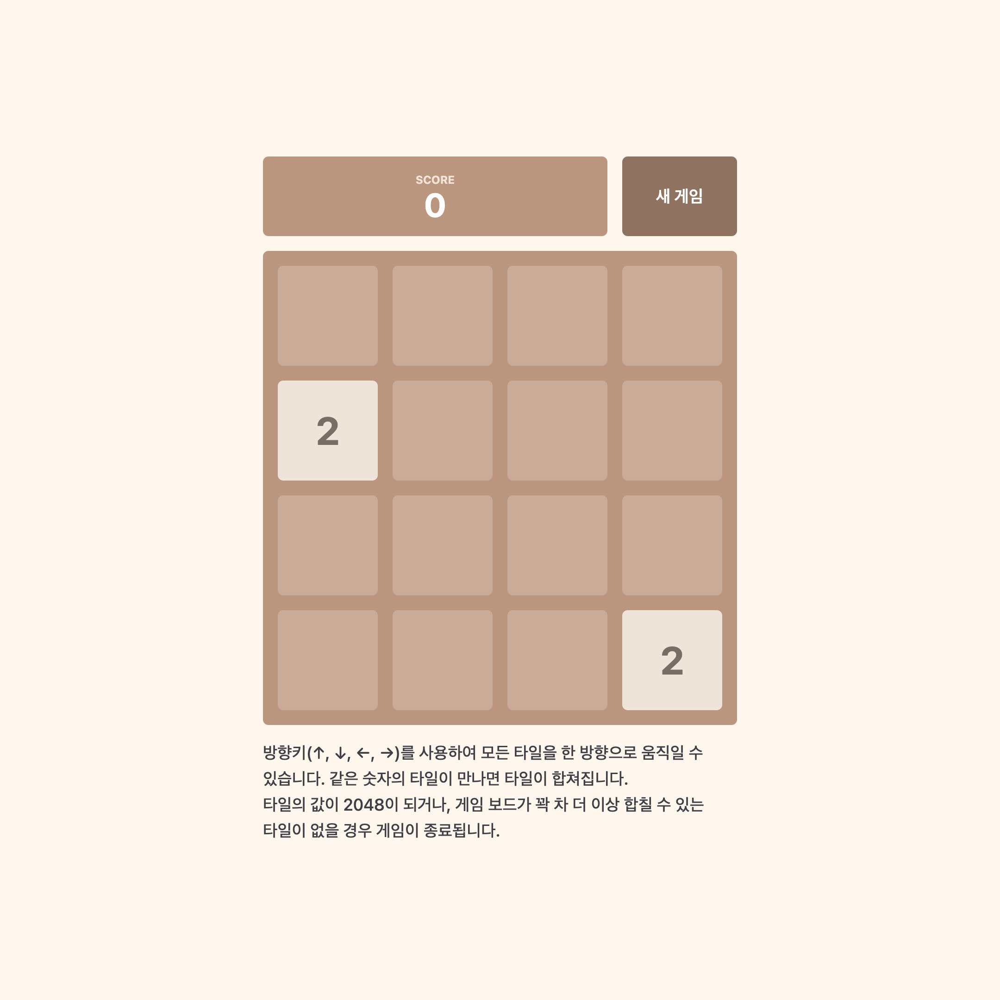

# 2048

## 개요

이 프로젝트는 친구가 2048 게임을 플레이하며 몇 가지 기능이 더 있었으면 좋겠다는 말을 듣고 시작하게 되었습니다. 2048 게임은 타일을 이동하여 타일의 값을 2048로 만드는 퍼즐 게임입니다. 이 프로젝트의 목표는 앵귤러를 활용하여 2048 게임을 구현함으로써 프론트엔드 개발 능력을 향상시키는 것입니다. 이 프로젝트를 통해 즐겁게 개발하며 프론트엔드 개발 능력 향상 및 친구에게 공유하여 피드백을 받고 개선하는 과정에서 팀워크 스킬까지 발전시킬 수 있었습니다.

[게임 플레이 하러가기](https://990225.github.io/2048/)

## 기능

- 새 게임: 새로운 게임이 시작되면 게임 보드와 점수가 초기화 되고, 랜덤한 위치에 2 또는 4의 값을 가진 두 개의 타일이 배치됩니다.
- 타일 이동: 방향키를 통해 타일들을 이동시킬 수 있습니다.
- 타일 합치기: 타일 이동 중 같은 값을 가진 두 타일이 만났을 경우 타일이 합쳐지며, 합쳐진 타일의 값에 따라 점수가 증가합니다.
- 타일 생성: 타일 이동 후 빈 공간 중 랜덤한 위치에 2 또는 4의 값을 가진 한 개의 타일이 배치됩니다.
- 점수 표시: 현재 점수가 화면에 표시됩니다.

## 기술 스택

- HTML
- CSS, Tailwind CSS
- Angular, TypeScript

## 추가 예정

- 게임 오버 조건 및 게임 종료 시 화면에 메시지 표시
- 타일 이동, 합치기, 생성 애니메이션 및 점수 증가 애니메이션
- 최고 점수 기록
- 랭킹 시스템
- 진행중인 게임 저장 및 불러오기
- 이전 상태로 되돌리기

## 스크린샷

